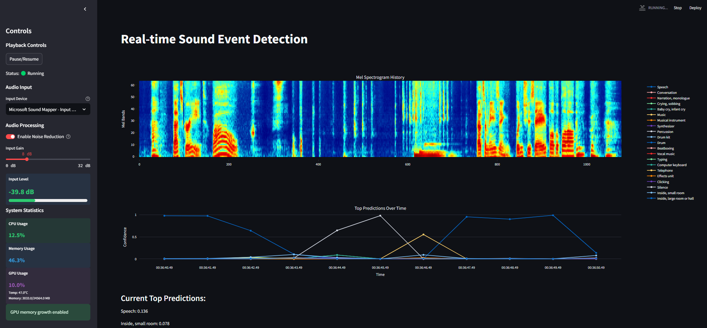

# Realtime YAMNET Sound Event Detection 🎤 🔊

A real-time Sound Event Detection (SED) system powered by [YAMNet](https://github.com/tensorflow/models/tree/master/research/audioset/yamnet), utilizing your device's microphone for continuous audio analysis, with support for noise reduction and input gain preprocessing.



## Overview 🎯

This application performs real-time sound event detection using Google's YAMNet deep neural network model, which can identify 521 different audio events. The system processes audio input every second and displays the top 5 most probable sound events it detects.

## Features ✨

- 🎧 Real-time audio processing using PyAudio
- 🤖 Continuous sound event detection using YAMNet
- 📊 Display of top 5 detected sound events with confidence scores
- 🎵 Support for 521 different audio event classes
- ⚡ Low-latency processing (1-second intervals)

## Prerequisites 🛠️

- Python 3.6 or higher
- PyAudio
- TensorFlow 2.x
- NumPy

## Installation 📥

1. Clone this repository:
```bash
git clone https://github.com/yourusername/realtime_YAMNET.git
cd realtime_YAMNET
```

2. Download the pre-trained YAMNet model:
```bash
# Download manually from Google Storage
wget https://storage.googleapis.com/audioset/yamnet.h5
# Place the downloaded file in the yamnet folder
mv yamnet.h5 yamnet/
```

3. Install dependencies:
```bash
pip install tensorflow numpy pyaudio
```

## Usage 🚀

Run the application with:
```bash
python realtime_YAMNET.py
```

The system will immediately begin capturing audio from your default microphone and display real-time detection results.


## How It Works 🔍

1. The system captures audio input through your device's microphone using PyAudio
2. Audio is processed in 1-second segments
3. YAMNet analyzes the audio segment and produces probability scores for 521 different sound events
4. The top 5 most probable sound events are displayed in real-time
5. The process continues until the application is terminated

## Supported Sound Events 🔉

YAMNet can detect 521 different audio events from the [AudioSet ontology](https://research.google.com/audioset/), including:
- 🗣️ Human sounds (speech, whistling, laughing)
- 🐾 Animal sounds (dog barking, cat meowing, bird songs)
- 🎸 Musical instruments
- 🚗 Vehicle sounds
- 🌳 Environmental sounds
- And many more...

## License 📄

This project is licensed under the MIT License - see the LICENSE file for details.

## Acknowledgments 🙏

- [YAMNet](https://github.com/tensorflow/models/tree/master/research/audioset/yamnet) by Google Research
- [AudioSet](https://research.google.com/audioset/) project
- [realtime_YAMNET](https://github.com/SangwonSUH/realtime_YAMNET) original fork
- [DTLN](https://github.com/breizhn/DTLN) for noise reduction

## Contributing 🤝

Contributions are welcome! Please feel free to submit a Pull Request.
